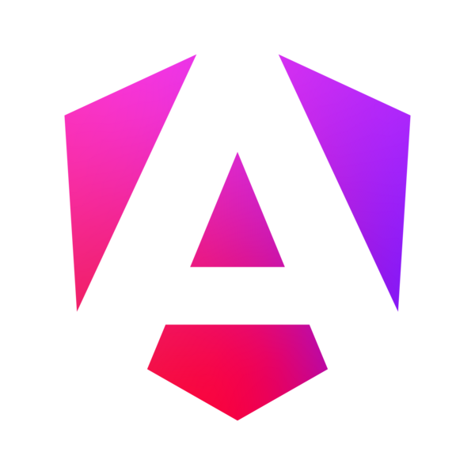
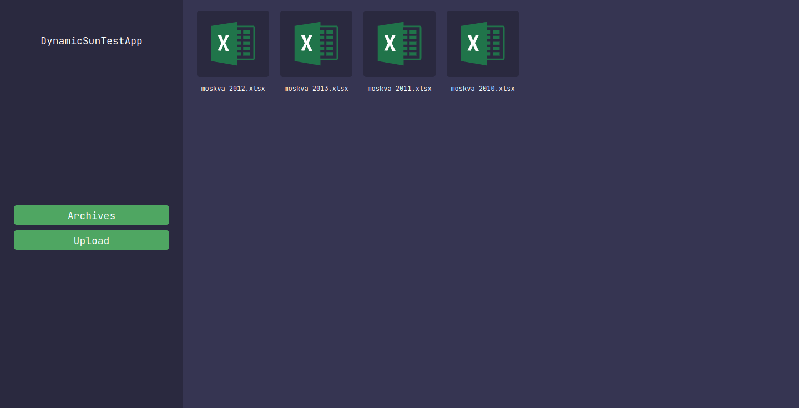
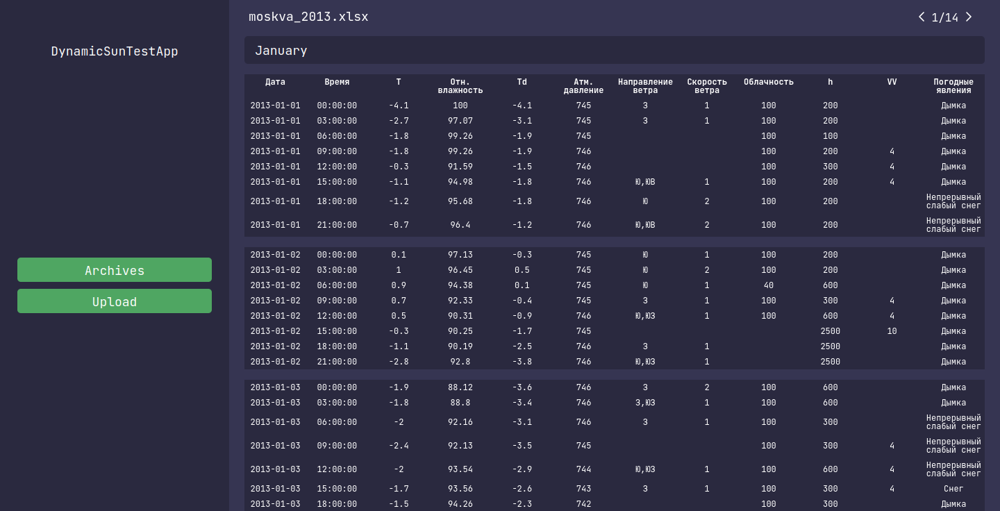
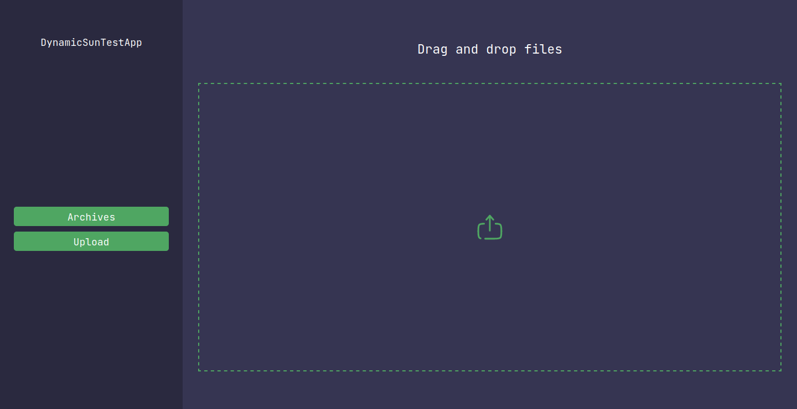

  

  <h1> DynamicSun TestApp</h1>

- **Video**: https://www.youtube.com/watch?v=i84ZyFhbRNM

## Required Software

- **.NET SDK 8.0.101 or later:** https://dotnet.microsoft.com/en-us/download
- **NVM for windows:** https://github.com/coreybutler/nvm-windows
- **Angular CLI:** `17.1.3`
- **NodeJS:** `20.10.0`
- **NPM:** `10.2.3`
- **Docker:** https://docs.docker.com/get-docker/
- **IDE**: Visual Studio 2022 or JetBrains Rider

## How to run in Debug mode

### Build Angular client

- Install NVM: `choco install nvm -y`
- Install NodeJS `20.10.0` using NVM & PowerShell as Administrator: `nvm install 20.10.0`
- Use NodeJS `20.10.0` using NVM via PowerShell as Administrator: `nvm use 20.10.0`
- Check NodeJS installed properly (should be `20.10.0`): `node -v`
- Check NPM installed properly (should be `10.2.3`): `npm -v`
- Go to the project folder: `cd ITPDevelopment.Client`
- Restore node modules: `npm ci`
- Install Angular CLI globally: `npm install -g @angular/cli@17.1.3`
- Open PowerShell as Administrator and type: `Set-ExecutionPolicy -ExecutionPolicy RemoteSigned`
- Check that Angular CLI installed properly: `ng version`
- Build project for development using Angular CLI: `ng build`
- Run angular client: `ng serve`

## Screenshots

### Archives

### Archive Records

### Upload

## Technology stack

- **SDK:** `.NET 8`
- **Frameworks:** `ASP .NET Core`, `Angular 17`
- **Persistence:**
    - Database: `PostgreSQL 15`
    - ORM: `Entity Framework Core`
- **Unit and Integration Testing:** `XUnit`, `FluentAssertions`
- **Containerization:** `Docker`
- **Programming languages:** `C#`, `SQL`, `TypeScript`
- **Tools & IDE:** `Visual Studio`, `Rider`, `WebStorm`,

## How to run Docker compose

- `docker compose up`